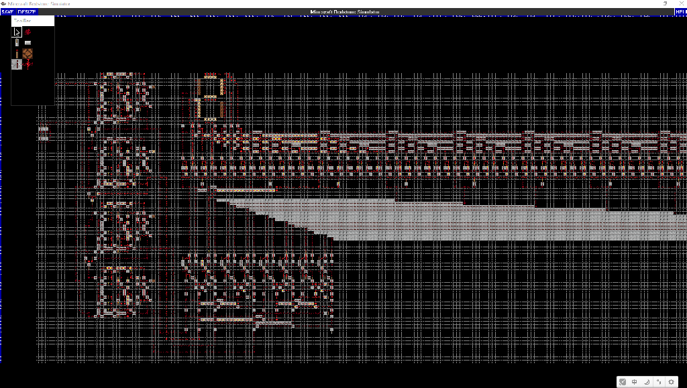

# MinecraftRedstoneSimulator

使用 EasyX 制作的平面红石电路模拟器

## 前言

> 相信 MC 红石电路的强大是人尽皆知的。在 MC 中，你甚至可以用红石电路造出 CPU，实现计算机。
>
> 此程序模拟 MC 红石运行环境，支持平面红石电路设计和仿真运行，可以实现许多复杂的逻辑电路。

**此模拟器实现的红石和原生红石的区别：**
1. 仅支持部分红石方块
2. 中继器仅用于单向导电和充能红石火把，不支持其它特性
2. 红石火把必须用中继器充能才会熄灭

## 编译环境

Windows 10 | Visual Studio 2022 | EasyX 20220610

此程序使用 EasyX 图形库实现绘制，图形库 [官网](https://easyx.cn)

依赖库 [HiEasyX](https://www.github.com/zouhuidong/HiEasyX)

## 模拟效果

下面将由简到繁，展示此模拟器实现的电路效果

 
<b>搭建与门</b>

 

 
<b>寄存器</b>

 

 
<b>加法器</b>

 

 
<b>数码管</b>

 

更复杂的电路还在等待您的实现~

## 操作指南

1. 可以在程序中使用鼠标操作地图，详细说明可以点击程序右上角的“HELP”按钮查看。
2. 程序附有示例地图文件（`./maps/`），在程序中选择 `Open a project` 并打开 `.rsp` 文件即可。

## 注意事项

若要导入已有地图到当前地图，请在程序的命令行窗口中使用 `import` 指令（需要在指令中指定导入坐标），详情可在命令行窗口输入 `help` 查看。

