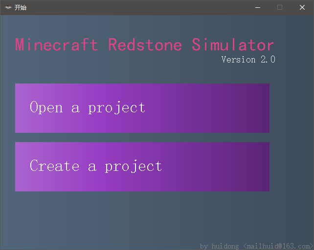
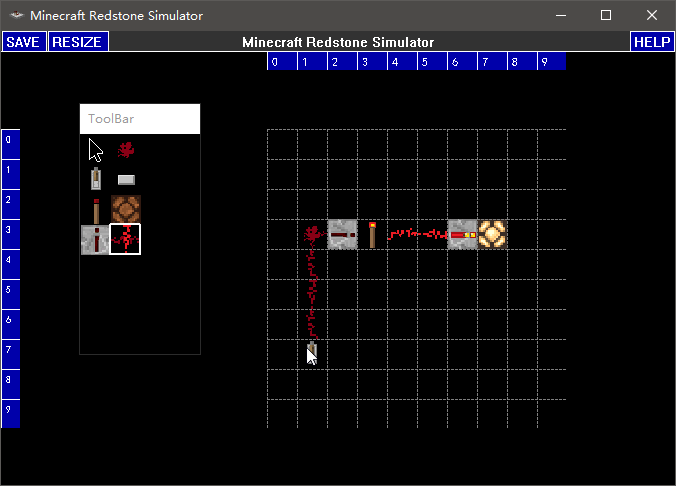
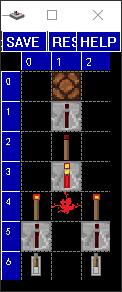
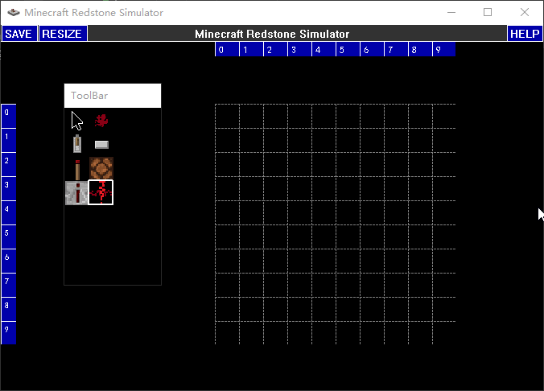
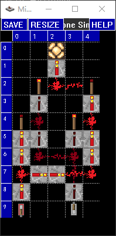
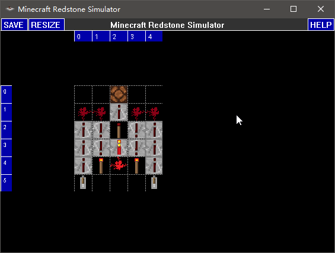
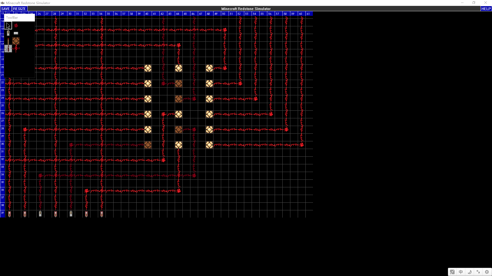
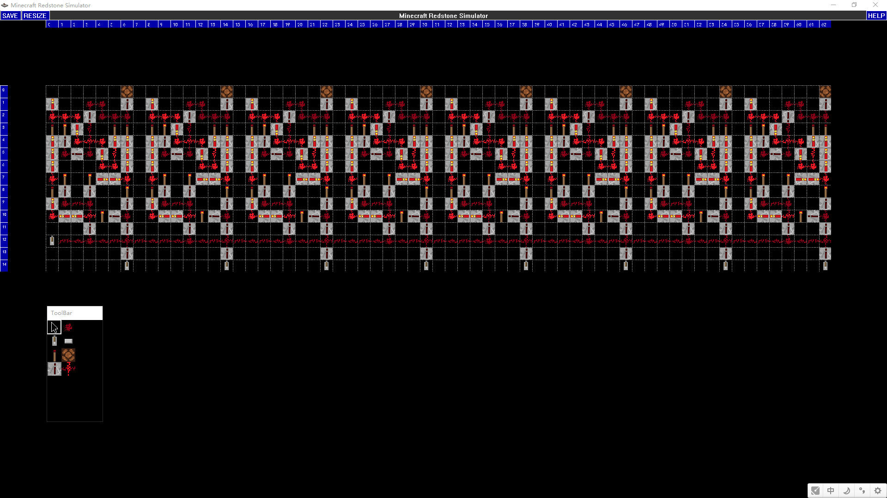
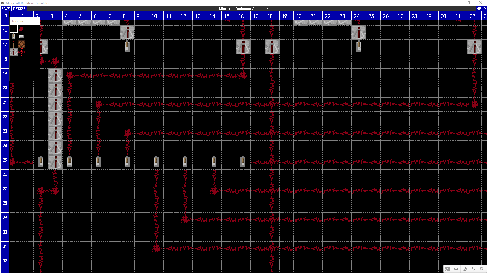

# MinecraftRedstoneSimulator

使用 EasyX 制作的平面红石电路模拟器

## 前言

> 相信 MC 红石电路的强大是人尽皆知的。在 MC 中，你甚至可以用红石电路造出 CPU，实现计算机。
>
> 此程序模拟 MC 红石运行环境，支持平面红石电路设计和仿真运行，可以实现许多复杂的逻辑电路。

## 编译环境

Windows 10 | Visual Studio 2022 | EasyX 20220610

依赖库 [HiEasyX](https://www.github.com/zouhuidong/HiEasyX)

## 模拟效果

下面将由简到繁，展示此模拟器实现的电路效果

开始界面

非门

与门

搭建与门

异或门

重设地图大小

点阵灯

寄存器

加法器

更复杂的电路还在等待您的实现~

